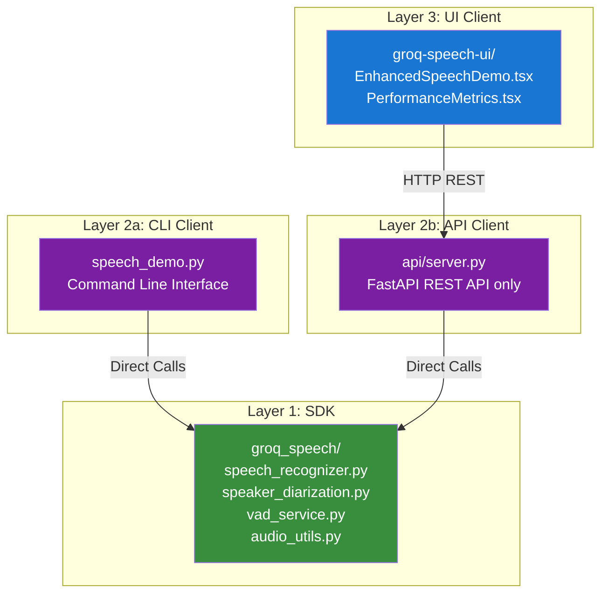

# Groq Speech Processing Demo

A comprehensive **demonstration project** showcasing speech recognition and translation capabilities using the Groq API. This project features speaker diarization, real-time processing, and both CLI and web interfaces to illustrate potential customer use cases.

> **⚠️ Important Disclaimer**: This is a **demonstrative solution** created to showcase various speech processing use cases with the Groq API. It is **not production-grade** and should be used as a reference implementation for learning and prototyping purposes. For production deployments, additional testing, security hardening, error handling, and performance optimization are required.

## 🎥 **Video Demo**

https://github.com/user-attachments/assets/a110ca11-a1c4-472d-aca6-dbb9cad6b663

---

## 🚀 **Quick Start**

### **Prerequisites**
- Python 3.8+
- Node.js 22 (for web UI)
- Groq API key ([Get one here](https://console.groq.com/keys))
- Hugging Face token (**Required for diarization**):
  - **Get token:** [https://huggingface.co/settings/tokens](https://huggingface.co/settings/tokens)
  - **⚠️ MUST accept model licenses first** - See [HuggingFace Models & License Requirements](#️-huggingface-models--license-requirements-required-for-diarization) below

### **Automated Setup (Recommended)**

Run the automated setup script to install all dependencies and configure environments for this demonstration:

```bash
# Clone the repository
git clone https://github.com/build-with-groq/groq-speech
cd groq-speech

# Run the setup script (installs everything)
./setup.sh
```

The setup script will:
- ✅ Create a Python virtual environment (`.venv/`)
- ✅ Install all Python dependencies (core library, API server, examples)
- ✅ Install Node.js dependencies for the web UI
- ✅ Create `.env.api` and `.env.ui` configuration files

After setup completes:
1. **Edit `.env.api`** and add your API keys:
   ```bash
   GROQ_API_KEY=your_actual_groq_api_key_here
   HF_TOKEN=your_huggingface_token_here  # Get from: https://huggingface.co/settings/tokens (see HuggingFace section below for license requirements)
   ```

2. **Activate the virtual environment** (required for Python commands):
   ```bash
   source .venv/bin/activate
   ```

### **Manual Setup (Alternative)**

If you prefer manual setup:

1. **Clone the repository:**
```bash
git clone https://github.com/build-with-groq/groq-speech
cd groq-speech
```

2. **Create and activate Python virtual environment:**
```bash
python3 -m venv .venv
source .venv/bin/activate  # On Windows: .venv\Scripts\activate
```

3. **Install Python dependencies:**
```bash
# Upgrade pip
pip install --upgrade pip

# Install the core package
pip install -e .

# Install all requirements
pip install -r requirements.txt
pip install -r groq_speech/requirements.txt
```

4. **Install Node.js dependencies for the web UI:**
```bash
cd examples/groq-speech-ui
npm install
cd ../..
```

5. **Configure environment variables:**
```bash
# Copy template files
cp .env.api.template .env.api
cp .env.ui.template .env.ui

# Edit .env.api with your API keys
# GROQ_API_KEY=your_actual_groq_api_key_here
# HF_TOKEN=your_huggingface_token_here  # Get from: https://huggingface.co/settings/tokens (see HuggingFace section below for license requirements)

# .env.ui defaults should work for local development
```

### **Usage**

> **Note:** Make sure to activate the Python virtual environment before running any Python commands:
> ```bash
> source .venv/bin/activate  # On Windows: .venv\Scripts\activate
> ```

#### **CLI Interface (Direct Library Access)**
```bash
# Activate virtual environment first
source .venv/bin/activate

# File transcription
python examples/speech_demo.py --file audio.wav

# File transcription with diarization
python examples/speech_demo.py --file audio.wav --diarize

# Microphone single mode
python examples/speech_demo.py --microphone-mode single

# Microphone continuous mode with diarization
python examples/speech_demo.py --microphone-mode continuous --diarize

# Translation mode
python examples/speech_demo.py --file audio.wav --operation translation --diarize
```

#### **Web Interface (REST API)**
```bash
# Terminal 1: Start API server
source .venv/bin/activate  # Activate virtual environment
cd api && python server.py

# Terminal 2: Start frontend (in another terminal)
cd examples/groq-speech-ui
npm run dev

# Open http://localhost:3000 in your browser
```

#### **Development Server (Recommended for Development)**
```bash
# One-command startup (starts both backend and frontend)
./scripts/dev/run-dev.sh

# With verbose logging
./scripts/dev/run-dev.sh --verbose

# Clean up existing processes
./scripts/dev/run-dev.sh --clean

# Access the application at:
# - Frontend: https://localhost:3443 (HTTPS for microphone access)
# - Backend API: http://localhost:8000
# - API Docs: http://localhost:8000/docs
```

**Features:**
- ✅ Automatically starts both backend and frontend
- ✅ Checks and validates environment configuration
- ✅ Installs missing dependencies
- ✅ HTTPS support for microphone access (self-signed certificate)
- ✅ Verbose mode for detailed logging
- ✅ Auto-cleanup of existing processes

**Note:** Your browser will show a security warning for the self-signed certificate. Click "Advanced" and "Proceed to localhost" to continue.

#### **Docker Local Deployment**
```bash
# Quick deployment with helper script
./deployment/docker/deploy-local.sh

# Or manually with docker-compose
docker-compose -f deployment/docker/docker-compose.yml up --build

# Access the application at:
# - Frontend: https://localhost:3443 (HTTPS for microphone access)
# - Backend API: http://localhost:8000
# - API Docs: http://localhost:8000/docs
```

**Docker Management:**
```bash
# View logs
docker-compose -f deployment/docker/docker-compose.yml logs -f

# Stop services
docker-compose -f deployment/docker/docker-compose.yml down

# Restart services
docker-compose -f deployment/docker/docker-compose.yml restart

# View specific service logs
docker-compose -f deployment/docker/docker-compose.yml logs -f groq-speech-api
docker-compose -f deployment/docker/docker-compose.yml logs -f groq-speech-ui
```

**Requirements for Docker:**
- Create `deployment/docker/.env.api` and `deployment/docker/.env.ui` files
- The `deploy-local.sh` script will copy templates if they don't exist
- Make sure to set your actual `GROQ_API_KEY` and `HF_TOKEN` in `.env.api`

---

## ⚠️ **HuggingFace Models & License Requirements** (Required for Diarization)

> **🚨 IMPORTANT:** You **MUST** accept model licenses on HuggingFace **BEFORE** using diarization features, or you will encounter authentication errors.

### **Models Used**

This project uses the following HuggingFace models for **speaker diarization**:

> ### 🎯 **Required Models**
> 
> 1. **[pyannote/segmentation-3.0](https://huggingface.co/pyannote/segmentation-3.0)**
>    - Purpose: Audio segmentation and speaker turn detection
>    - License: MIT License
> 
> 2. **[pyannote/speaker-diarization-3.1](https://huggingface.co/pyannote/speaker-diarization-3.1)**
>    - Purpose: Complete speaker diarization pipeline
>    - License: MIT License

### **⚠️ License Acceptance Required**

**❌ What happens if you don't accept the licenses:**
```
GatedRepoError: Access to model pyannote/speaker-diarization-3.1 is restricted.
You must be authenticated to access it and have accepted the model's terms and conditions.
```

Or you might see:
```
OSError: You are trying to access a gated repo.
Make sure to request access at https://huggingface.co/pyannote/speaker-diarization-3.1
and pass a token having permission to this repo either by logging in with 
`huggingface-cli login` or by passing `use_auth_token=<your_token>`.
```

### **✅ How to Accept Model Licenses**

Follow these steps **BEFORE** running diarization:

#### **Step 1: Create HuggingFace Account**
1. Go to [https://huggingface.co/join](https://huggingface.co/join)
2. Create a free account (if you don't have one)

#### **Step 2: Accept Model Licenses**

You must accept the license for **each model individually**:

**For pyannote/segmentation-3.0:**
1. Visit: [https://huggingface.co/pyannote/segmentation-3.0](https://huggingface.co/pyannote/segmentation-3.0)
2. Scroll down to the model card
3. Click **"Agree and access repository"** button
4. You may need to fill out a form with:
   - Your name
   - Organization (can be "Individual" or "Personal")
   - Country
   - Agree to terms checkbox

**For pyannote/speaker-diarization-3.1:**
1. Visit: [https://huggingface.co/pyannote/speaker-diarization-3.1](https://huggingface.co/pyannote/speaker-diarization-3.1)
2. Scroll down to the model card
3. Click **"Agree and access repository"** button
4. Fill out the same form as above

**Example of what you'll see:**
```
┌─────────────────────────────────────────────────────────┐
│  Access pyannote/speaker-diarization-3.1                │
│                                                           │
│  By clicking below, you agree to share your contact      │
│  information (username and email) with the model authors.│
│                                                           │
│  Name:     [Your Name]                                   │
│  Email:    [your@email.com]                              │
│  Org:      [Individual/Company]                          │
│  Country:  [Your Country]                                │
│                                                           │
│  ☐ I have read the License and agree to its terms       │
│                                                           │
│  [Agree and Access Repository]                           │
└─────────────────────────────────────────────────────────┘
```

#### **Step 3: Get Your HuggingFace Token**
1. Go to [https://huggingface.co/settings/tokens](https://huggingface.co/settings/tokens)
2. Click **"New token"**
3. Name it (e.g., "groq-speech-diarization")
4. Select **"Read"** permission (minimum required)
5. Click **"Generate token"**
6. **Copy the token** (you won't be able to see it again!)

#### **Step 4: Add Token to Environment**

Add the token to your `.env.api` file:
```bash
HF_TOKEN=hf_xxxxxxxxxxxxxxxxxxxxxxxxxxxxx
```

**Note:** HuggingFace tokens start with `hf_`

### **🧪 Testing License Access**

To verify your licenses are accepted, run:
```bash
# Activate virtual environment
source .venv/bin/activate

# Test with a simple diarization
python examples/speech_demo.py --file examples/test_audio.wav --diarize
```

If licenses are properly accepted, you should see:
```
🎭 Running CORRECT diarization pipeline...
   1. Pyannote.audio → Speaker detection
   ✅ Pipeline loaded and moved to cuda
   ✅ Detected X speaker segments
```

If licenses are NOT accepted, you'll see authentication errors as shown above.

---

## 🏗️ **Architecture**

### **3-Layer Architecture**



### **Key Components**

#### **Core SDK (`groq_speech/`)**
- **`speech_recognizer.py`** - Main orchestrator, handles all speech processing
- **`speech_config.py`** - Configuration management with factory methods
- **`speaker_diarization.py`** - Speaker diarization using Pyannote.audio
- **`vad_service.py`** - Voice Activity Detection service
- **`audio_utils.py`** - Audio format utilities and conversion
- **`exceptions.py`** - Custom exception classes
- **`result_reason.py`** - Result status enums

#### **API Server (`api/`)**
- **`server.py`** - FastAPI server with REST endpoints only
- **`models/`** - Pydantic request/response models
- **REST API** - HTTP endpoints for all operations

#### **Frontend (`examples/groq-speech-ui/`)**
- **`EnhancedSpeechDemo.tsx`** - Main UI component with all features
- **`audio-recorder.ts`** - Unified audio recording (standard + optimized)
- **`continuous-audio-recorder.ts`** - VAD-based continuous recording
- **`client-vad-service.ts`** - Client-side Voice Activity Detection
- **`audio-converter.ts`** - Unified audio conversion (standard + optimized)
- **`groq-api.ts`** - REST API client

## 🔄 **Data Flow**

### **CLI Flow (Direct Access)**
```
Audio Input → numpy array → SDK Processing → Console Output
```

### **Web UI Flow (REST API)**
```
Audio Input → Frontend Processing → HTTP REST → API Server → SDK Processing → JSON Response → UI Display
```

### **Audio Format Handling**
- **File Processing**: Base64-encoded WAV → HTTP REST → base64 decode → numpy array
- **Microphone Processing**: Float32Array → HTTP REST → array conversion → numpy array
- **VAD Processing**: Client-side for real-time performance

## 🎯 **Features**

### **Speech Recognition**
- ✅ File-based transcription
- ✅ Microphone single mode
- ✅ Microphone continuous mode with VAD
- ✅ Real-time audio level visualization
- ✅ Silence detection and chunking

### **Translation**
- ✅ File-based translation
- ✅ Microphone translation
- ✅ Multi-language support
- ✅ Target language configuration

### **Speaker Diarization**
- ✅ Pyannote.audio integration
- ✅ GPU acceleration support
- ✅ Multi-speaker detection
- ✅ Speaker-specific segments

### **Voice Activity Detection (VAD)**
- ✅ Client-side real-time processing
- ✅ 15-second silence detection
- ✅ Audio level visualization
- ✅ Automatic chunk creation

### **Performance Optimizations**
- ✅ Unified audio recorders (standard + optimized)
- ✅ Unified audio converters (standard + optimized)
- ✅ Client-side VAD for real-time processing
- ✅ Chunked processing for large files
- ✅ Memory-efficient operations

## 🔌 **API Endpoints**

### **Core Endpoints**
- `POST /api/v1/recognize` - File transcription
- `POST /api/v1/translate` - File translation
- `POST /api/v1/recognize-microphone` - Single microphone processing
- `POST /api/v1/recognize-microphone-continuous` - Continuous microphone processing

### **Utility Endpoints**
- `GET /health` - Health check
- `GET /api/v1/models` - Available models
- `GET /api/v1/languages` - Supported languages
- `POST /api/log` - Frontend logging

### **VAD Endpoints (Legacy)**
- `POST /api/v1/vad/should-create-chunk` - VAD chunk detection
- `POST /api/v1/vad/audio-level` - Audio level analysis

## 🐳 **Deployment**

### **Docker (Local Development)**
```bash
# Standard deployment
docker-compose -f deployment/docker/docker-compose.yml up

# GPU-enabled deployment
docker-compose -f deployment/docker/docker-compose.gpu.yml up

# Development with hot reload
docker-compose -f deployment/docker/docker-compose.dev.yml up
```

### **GCP Cloud Run (Production)**
```bash
# Deploy to Cloud Run with GPU support
cd deployment/gcp
./deploy.sh
```

## 📊 **Performance**

### **CLI Performance**
- **Direct SDK access** - No network overhead
- **Real-time VAD** - Local processing
- **Memory efficient** - Direct numpy array handling

### **Web UI Performance**
- **Client-side VAD** - Real-time silence detection
- **Unified components** - Optimized for both short and long audio
- **Chunked processing** - Handles large files efficiently
- **REST API** - Scalable and maintainable

## 🔧 **Configuration**

### **Environment Variables**

The project uses two separate environment files for better isolation:

#### **`.env.api` - Python/API Configuration**
Used by: SDK, speech_demo.py, API server

```bash
# Required: Groq API Key
GROQ_API_KEY=your_groq_api_key_here

# Required for speaker diarization (Get from: https://huggingface.co/settings/tokens - see HuggingFace Models section for license requirements)
HF_TOKEN=your_huggingface_token_here

# Optional: API Configuration
GROQ_API_BASE=https://api.groq.com/openai/v1
GROQ_MODEL_ID=whisper-large-v3
GROQ_TEMPERATURE=0.0
GROQ_RESPONSE_FORMAT=verbose_json

# Optional: Server Settings
API_HOST=0.0.0.0
API_PORT=8000
API_WORKERS=1

# Optional: GPU Configuration
CUDA_VISIBLE_DEVICES=0
```

#### **`.env.ui` - Next.js UI Configuration**
Used by: groq-speech-ui web application

```bash
# Required: API Connection
NEXT_PUBLIC_API_URL=http://localhost:8000

# Optional: UI Settings
NEXT_PUBLIC_FRONTEND_URL=http://localhost:3000
NEXT_PUBLIC_VERBOSE=false
NEXT_PUBLIC_DEBUG=false
```

**Getting API Keys:**
- **GROQ_API_KEY**: Get from [Groq Console](https://console.groq.com/keys)
- **HF_TOKEN**: Get from [HuggingFace Tokens](https://huggingface.co/settings/tokens) - See [HuggingFace Models & License Requirements](#️-huggingface-models--license-requirements-required-for-diarization) section above for complete setup instructions

### **Audio Settings**
- **Sample Rate**: 16kHz (standard)
- **Channels**: Mono (1 channel)
- **Format**: Float32Array (microphone), WAV (files)
- **VAD Threshold**: 0.003 RMS (conservative detection)

## 📚 **Documentation**

> **All documentation is now organized in [docs/](docs/)** for better maintainability.

### 🚀 Getting Started
- **[Quick Start Guide](docs/QUICKSTART.md)** - Get up and running in minutes
- **[Environment Setup](docs/ENVIRONMENT_SETUP.md)** - Detailed environment configuration
- **[Scripts Reference](docs/SCRIPTS.md)** - Complete guide to all scripts

### 📖 Core Documentation
- **[SDK Reference](docs/SDK_REFERENCE.md)** - Complete SDK API documentation
- **[Architecture Guide](docs/ARCHITECTURE.md)** - System architecture and design
- **[Deployment Guide](docs/DEPLOYMENT.md)** - Docker, Cloud Run, and GKE deployment

### 🔧 Development
- **[Contributing Guide](docs/CONTRIBUTING.md)** - Development guidelines
- **[Debugging Guide](docs/DEBUGGING_GUIDE.md)** - Troubleshooting and debugging
- **[Changelog](docs/CHANGELOG.md)** - Version history

**📚 [Browse all documentation →](docs/README.md)**

## 🤝 **Contributing**

1. Fork the repository
2. Create a feature branch
3. Make your changes
4. Add tests if applicable
5. Submit a pull request

## 📄 **License**

This project is licensed under the MIT License - see the LICENSE file for details.

## 🆘 **Support**

For issues and questions:
1. Check the [documentation](docs/)
2. Review [existing issues](https://github.com/build-with-groq/groq-speech/issues)
3. Create a new issue with detailed information

---

## 👥 **Contributors**

**Built with ❤️ by:**
- **Sreenivas Manyam Rajaram** - [LinkedIn](https://www.linkedin.com/in/sreenivas-manyam-rajaram/)

**Technologies:**
- [Groq](https://groq.com/) - Lightning-fast AI inference
- [Pyannote.audio](https://github.com/pyannote/pyannote-audio) - Speaker diarization
- Modern web technologies (Next.js, React, TypeScript)

---

**Built with ❤️ using Groq, Pyannote.audio, and modern web technologies.**
