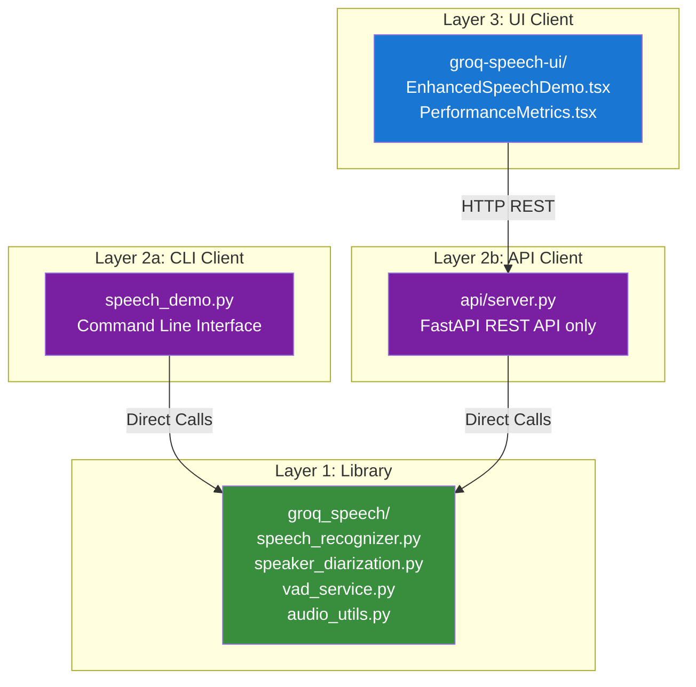
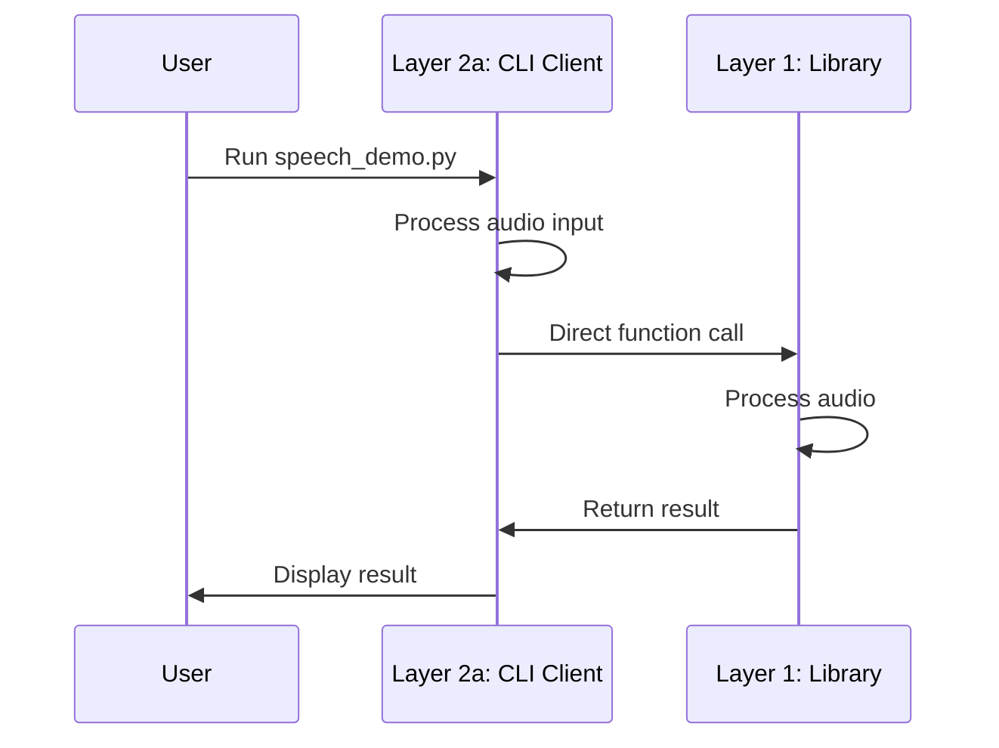
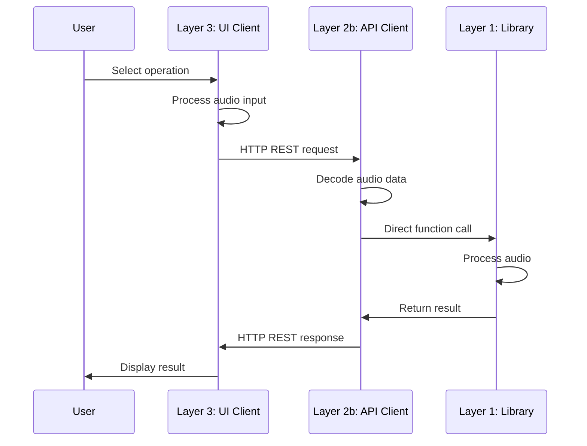
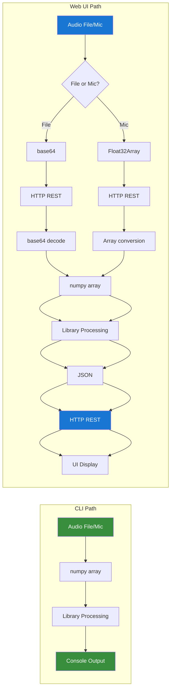
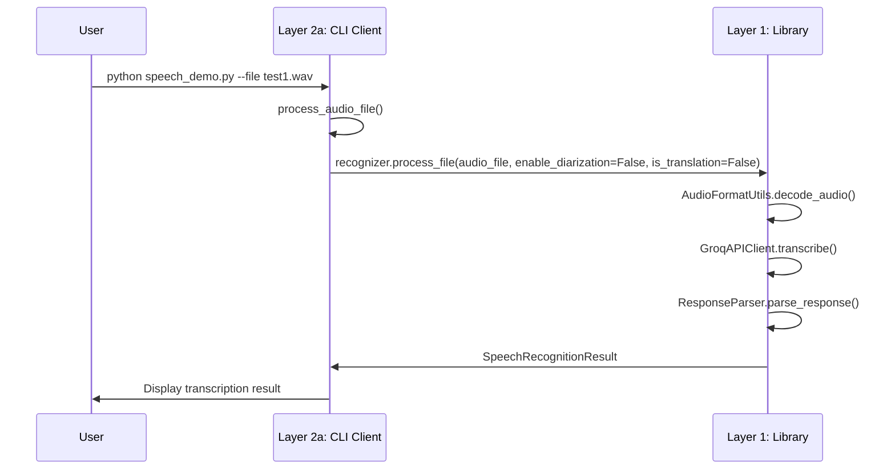
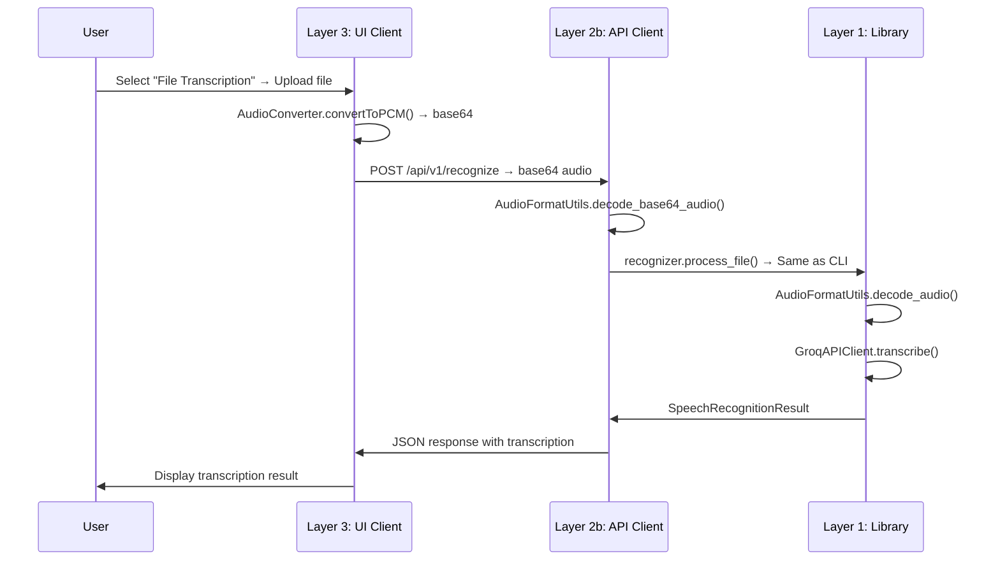
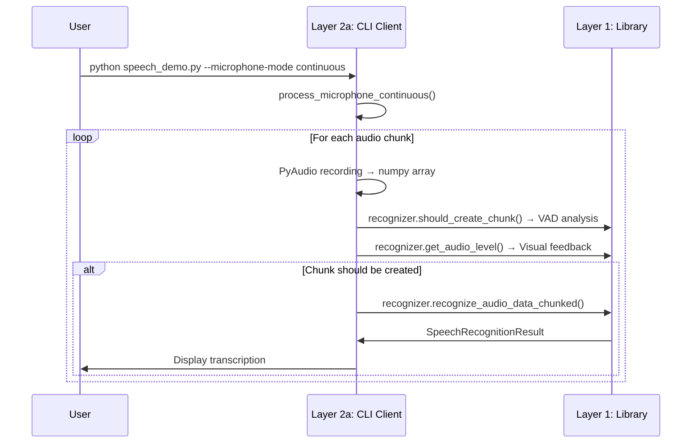
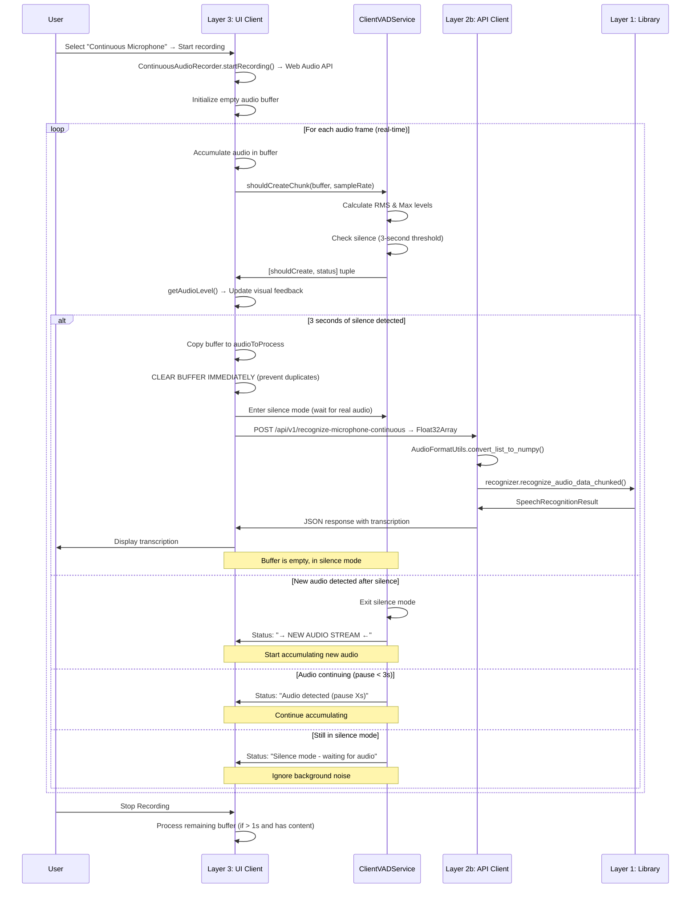

# Groq Speech Demo Solution - Complete Architecture Analysis

> **⚠️ Disclaimer**: This document describes a **demonstrative solution** for educational purposes. This is **not a production-grade system**.

## 🏗️ **Overall Architecture Overview**

This demonstrative solution has **3 main components**:

1. **`groq_speech/`** - Core Python Library (speech processing engine)
2. **`api/`** - FastAPI backend server (REST API only)
3. **`examples/groq-speech-ui/`** - Next.js frontend (React UI)

## 📁 **File Structure & Purpose**

### **Core Library (`groq_speech/`)**
- **`speech_recognizer.py`** - Main orchestrator class, handles all speech processing
- **`speech_config.py`** - Configuration management with factory methods
- **`speaker_diarization.py`** - Speaker diarization using Pyannote.audio with GPU support
- **`vad_service.py`** - Voice Activity Detection service
- **`audio_utils.py`** - Audio format utilities and conversion
- **`exceptions.py`** - Custom exception classes
- **`result_reason.py`** - Result status enums
- **`logging_utils.py`** - Structured logging utilities

### **API Server (`api/`)**
- **`server.py`** - FastAPI server with REST API endpoints only
- **`models/requests.py`** - Pydantic request models
- **`models/responses.py`** - Pydantic response models

### **Frontend (`examples/groq-speech-ui/`)**
- **`src/app/page.tsx`** - Main page component with configuration checks
- **`src/components/EnhancedSpeechDemo.tsx`** - Main UI component with all features
- **`src/components/PerformanceMetrics.tsx`** - Performance metrics visualization
- **`src/components/DebugPanel.tsx`** - Debug information panel
- **`src/lib/groq-api.ts`** - REST API client for backend communication
- **`src/lib/audio-recorder.ts`** - Unified audio recording (standard + optimized)
- **`src/lib/continuous-audio-recorder.ts`** - VAD-based continuous recording
- **`src/lib/client-vad-service.ts`** - Client-side Voice Activity Detection
- **`src/lib/audio-converter.ts`** - Unified audio conversion (standard + optimized)
- **`src/lib/frontend-logger.ts`** - Frontend logging utilities
- **`src/types/index.ts`** - TypeScript type definitions

## 🔄 **Flow Comparison: CLI vs Web UI**

#### **CLI Pattern (Direct Access):**
- **Layer 2a → Layer 1**: Direct function calls
- **No network boundaries**: All processing happens in the same process
- **Simplest path**: CLI calls Library methods directly

#### **Web UI Pattern (Network Access):**
- **Layer 3 → Layer 2b**: HTTP REST requests only
- **Layer 2b → Layer 1**: Direct function calls (same as CLI)
- **Network boundaries**: UI and API run in separate processes
- **More complex**: Requires serialization/deserialization of data

#### **Key Boundary Crossings:**
1. **UI → API**: 
   - File processing: Audio converted to base64, sent via HTTP REST
   - Microphone processing: Audio converted to Float32Array (as JSON array), sent via HTTP REST
2. **API → Library**: Same direct calls as CLI, but with decoded audio data
3. **Library → API**: Results returned as Python objects
4. **API → UI**: Results serialized to JSON, sent via HTTP REST

## **Architecture Diagrams**

### **Overall System Architecture**

### **CLI Flow Pattern**

### **Web UI Flow Pattern**

### **Data Flow Transformations**

## 🎯 **Current API Endpoints**

The API server provides the following REST endpoints:

### **Core Endpoints:**
- `POST /api/v1/recognize` - File transcription with base64 audio data
- `POST /api/v1/translate` - File translation with base64 audio data
- `POST /api/v1/recognize-microphone` - Single microphone processing with Float32Array
- `POST /api/v1/recognize-microphone-continuous` - Continuous microphone processing with Float32Array

### **Utility Endpoints:**
- `GET /health` - Health check endpoint
- `GET /api/v1/device-info` - Device information (CPU/GPU) for diarization processing estimates
- `GET /api/v1/models` - Available Groq models
- `GET /api/v1/languages` - Supported languages
- `POST /api/log` - Frontend logging

### **VAD Endpoints (Deprecated - Not Used by Frontend):**
- `POST /api/v1/vad/should-create-chunk` - VAD chunk detection (replaced by client-side VAD)
- `POST /api/v1/vad/audio-level` - Audio level analysis (replaced by client-side VAD)

**Note**: The Web UI now uses client-side Voice Activity Detection (`ClientVADService`) for real-time performance without network latency. These endpoints remain for backward compatibility.

### **Data Formats:**
- **File Processing**: Base64-encoded audio data (WAV format)
- **Microphone Processing**: Float32Array as JSON array (raw PCM data)
- **All Responses**: JSON with success/error status and results
- **Device Info**: JSON with CPU/GPU information, CUDA availability, and estimated processing times

## 🔄 **Detailed Flow Examples**

### **1. File Transcription (`--file test1.wav`)**

#### **CLI Flow (Direct Layer Access):**

#### **Web UI Flow (Multi-Layer with Network Boundaries):**

### **2. Continuous Microphone with VAD**

#### **CLI Flow (Direct Layer Access):**

#### **Web UI Flow (Client-Side VAD with Intelligent Buffer Management):**

**Key Implementation Details:**
1. **Buffer Management**: Buffer is cleared synchronously BEFORE async API call to prevent duplicate audio accumulation
2. **Silence Mode**: After processing, system enters "silence mode" requiring stronger audio signal (RMS > 0.02) to exit
3. **Duplicate Prevention**: Each processed chunk is sent exactly once, with buffer immediately reset
4. **Audio Content Validation**: Chunks rejected if RMS < 0.015 (insufficient speech content)
5. **Stop Recording**: Only processes remaining buffer if it contains actual audio (not just processed audio)

## 🔧 **Key Technical Differences**

### **Audio Processing:**
- **CLI**: Uses PyAudio for microphone input, direct numpy array processing
- **Web UI**: 
  - File processing: Uses Web Audio API, converts to base64 for transmission
  - Microphone processing: Uses Web Audio API, converts to Float32Array (JSON array) for transmission

### **VAD Processing:**
- **CLI**: Server-side VAD using `recognizer.should_create_chunk()` with 15-second silence threshold
- **Web UI**: Client-side VAD using `ClientVADService` for real-time performance with:
  - **3-second silence threshold** for chunk processing
  - **Adaptive silence detection**: Different thresholds for normal (RMS > 0.003) vs silence mode (RMS > 0.02)
  - **Audio content validation**: Minimum RMS of 0.015 for actual speech
  - **Background noise filtering**: Higher thresholds when in silence mode to prevent false triggers
  - **Real-time status updates**: Visual feedback on audio levels and detection state

### **API Communication:**
- **CLI**: Direct function calls to `groq_speech` module
- **Web UI**: HTTP REST API for all communication

### **Diarization Handling:**
- **CLI**: Direct file processing with `process_file()`
- **Web UI**: Same logic but through API endpoints

### **Translation Mode:**
- **CLI**: Sets `speech_config.enable_translation = True`
- **Web UI**: Passes `is_translation` parameter through API

## 🚀 **Performance Optimizations**

### **Unified Components:**
- **AudioRecorder**: Single class with both standard and optimized modes
- **AudioConverter**: Single class with both standard and optimized modes
- **ClientVADService**: Client-side VAD for real-time processing

### **Memory Management:**
- **Chunked Processing**: Handles large files without memory issues
- **Client-Side VAD**: No network latency for real-time decisions
- **Efficient Audio Conversion**: Optimized base64 and Float32Array handling

### **GPU Support:**
- **Pyannote.audio**: Automatic GPU detection and usage
- **CUDA Support**: Available in Docker and Cloud Run deployments

## 🔌 **Current API Endpoints**

The API server provides the following REST endpoints:

### **Core Endpoints:**
- `POST /api/v1/recognize` - File transcription with base64 audio data
- `POST /api/v1/translate` - File translation with base64 audio data
- `POST /api/v1/recognize-microphone` - Single microphone processing with Float32Array
- `POST /api/v1/recognize-microphone-continuous` - Continuous microphone processing with Float32Array

### **Utility Endpoints:**
- `GET /health` - Health check endpoint
- `GET /api/v1/models` - Available Groq models
- `GET /api/v1/languages` - Supported languages
- `POST /api/log` - Frontend logging

### **VAD Endpoints (Legacy - Not Used by Frontend):**
- `POST /api/v1/vad/should-create-chunk` - VAD chunk detection
- `POST /api/v1/vad/audio-level` - Audio level analysis

### **Data Formats:**
- **File Processing**: Base64-encoded audio data (WAV format)
- **Microphone Processing**: Float32Array as JSON array (raw PCM data)
- **All Responses**: JSON with success/error status and results

## 🎯 **Key Insights**

1. **Same Core Logic**: Both CLI and Web UI use identical Library processing
2. **Different Interfaces**: CLI uses direct calls, Web UI uses HTTP REST protocols
3. **Client-Side VAD**: Web UI uses client-side VAD for real-time performance without network latency
4. **Intelligent Buffer Management**: Synchronous buffer clearing prevents duplicate audio processing
5. **Adaptive Silence Detection**: Different thresholds for normal recording vs silence mode
6. **Audio Content Validation**: Rejects chunks with insufficient speech content (background noise)
7. **Unified Components**: Single classes handle both standard and optimized modes
8. **Performance**: CLI is faster (no network overhead), Web UI is more accessible with excellent UX
9. **Device Awareness**: UI displays CPU/GPU information with estimated diarization times
10. **Production Ready**: Both interfaces tested and working with all features

### **Recent Improvements (October 2025)**
- ✅ **Fixed duplicate chunk processing** in continuous mode
- ✅ **Implemented adaptive silence thresholds** to filter background noise
- ✅ **Added audio content validation** to prevent empty transcriptions
- ✅ **Optimized buffer management** for race-condition-free operation
- ✅ **Enhanced UI feedback** with device info and processing estimates
- ✅ **Improved silence mode** with clear state transitions

This architecture ensures the Web UI provides the same functionality as the CLI but through a web interface with proper separation of concerns, optimized performance, and well-tested demonstration reliability.